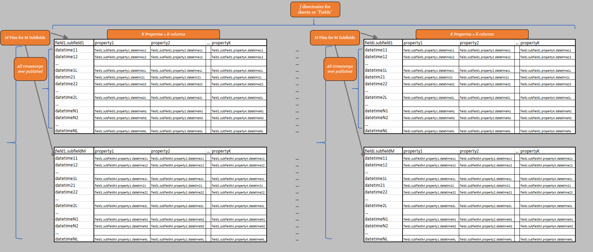

.. _usage:

Usage
=====

.. include:: substitutions.rst

.. _core_functionalities:
Core Functionalities
"""""""""""""""""""""
* Build a local database for the greek system (update mode)
.. figure:: figs/database_Viz.png
   :scale: 50 %

* Access, combine, transform, visualize, extract data from the database (query mode)
.. figure:: figs/plotly_viz.png
   :scale: 50 %
   :class: with-border

There are three potentially complementary ways of using ExSO:

* Through |xlsm|
* Through an :ref:`IDE <python_api>`
* Through the :ref:`command line <cli>`

.. _core_concepts:
Core Concepts
"""""""""""""""

Publisher
----------
* Publishers are the entities that publish the Reports. They may include AMIDE (IPTO), HEnEx, ENTSO-e, DESFA, etc.

Report
-------
* A report (or report type) is a category of files, for a specific system or market operation.
* For each report type, report files are published on a corresponding frequency (daily, weekly, annually, ad-hoc)
* Report Files may be excel or text files containing data for the specific report type, for a specific time period
    * In case of excel files, they may contain several Sheets.

Datalake
---------
* The datalake is a local directory created by **exso**, containing all report files as downloaded from the publishers
* The general structure is: :menuselection:`root --> Publisher --> ReportName --> Raw Report Files`
* The general structure of each Report File is: :menuselection:`file --> sheets --> fields --> properties`
.. figure:: figs/datalake_report_table.png
   :scale: 50 %
   :class: with-border

Database
---------
* The database is a local directory created by **exso**, containing a high-quality, continuous version of the raw report files
* The general structure is: :menuselection:`root --> Publisher --> ReportName --> Field (.csv) --> Property (file-columns)`

