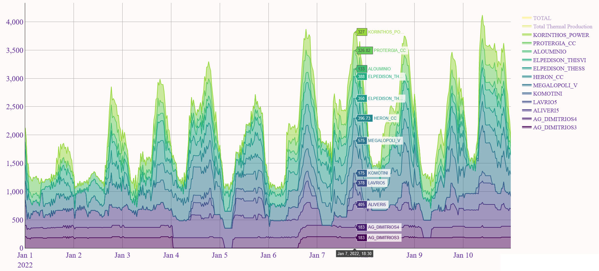

.. _usage:

Usage
=====

.. include:: substitutions.rst

Core Functionalities
"""""""""""""""""""""
* Build a local database for the greek system (update mode)
.. figure:: figs/database_Viz.png
   :scale: 50 %

* Access, combine, transform, visualize, extract data from the database (query mode)

There are three complementary and not necessarily contradictory ways of using ExSO:

* Through |xlsm|
* Through an :ref:`IDE <python_api>`
* Through the :ref:`command line <cli>`

